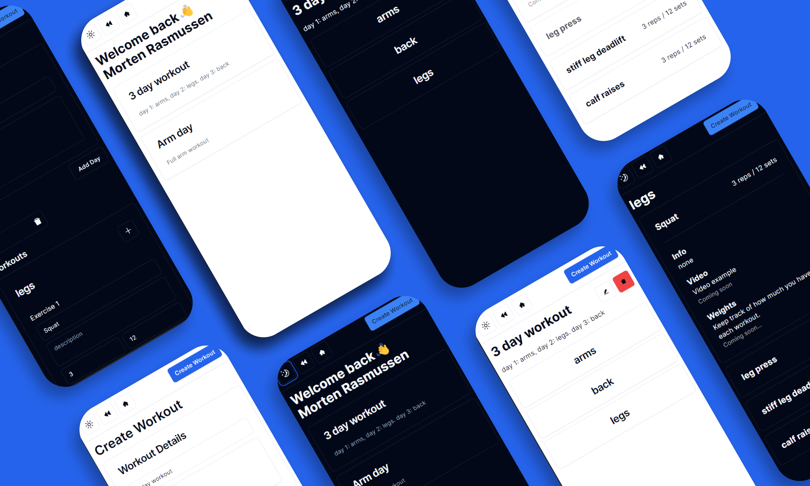

# [Fitify - you're new workout buddy](https://fitify-phi.vercel.app/)

Built with the Next.js App Router, TypeScript, Tailwind, Neon db and Drizzle orm.

## Features

 - Authentication using NextAuth
 - Create workout & edit workout page

## Tech Stack

- **Framework:** [Next.js](https://nextjs.org)
- **Styling:** [Tailwind CSS](https://tailwindcss.com)
- **Components library:** [ShadCn](https://ui.shadcn.com/)
- **Authentication:** [Next Auth](https://next-auth.js.org/)
- **ORM:** [Drizzle orm](https://orm.drizzle.team/)

## Features to be implemented

- [] keep track of how much you lifted last time with weights
- [] add youtube examples on you're workout
